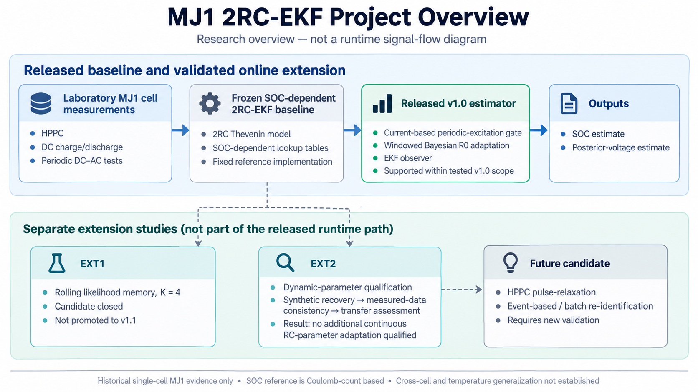

# MJ1 Adaptive 2RC–EKF SOC Estimation

**Experimental battery modelling, model-based SOC estimation, and gated Bayesian resistance adaptation in MATLAB and Simulink.**

[Adaptive v1 validation](docs/validation/adaptive_v1_validation.md) · [K=4 extension closeout](docs/validation/ext1_k4_candidate_closeout.md) · [EXT2 dynamic-parameter qualification](docs/validation/ext2_dynamic_parameter_adaptation_closeout.md) · [Frozen-EKF validation](docs/validation/A8c_validation_report.md) · [Model-selection analysis](docs/validation/A8c_candidate_decision.md) · [Reproduction guide](docs/validation/A8c_reproduction.md)

## Project overview

This project connects laboratory measurements from an LG INR18650 MJ1 cell to a SOC-dependent two-RC Thevenin model and an Extended Kalman Filter (EKF). The published adaptive implementation adds a current-based periodic-excitation gate and causal, windowed Bayesian updates of an ohmic-resistance multiplier. The frozen state-transition model and RC parameter maps remain unchanged.

Two separate extension studies examine whether additional adaptation is justified: **EXT1** investigates finite likelihood memory, while **EXT2** evaluates dynamic-parameter identifiability and measured-data target consistency. Neither study replaces the released v1.0 implementation.

*Research overview, not a runtime signal-flow diagram. Extension-study arrows indicate research relationships, not online signal connections.*

The EKF estimates `[v1, v2, SOC]` using model-specific state and voltage equations, numerical Jacobians, and a Joseph-form covariance update. The frozen lookup tables cover **17–85% SOC**, with a reference capacity of **3.335 Ah** and positive current defined as charging.

## Current qualification status

| Component or candidate | Status under the available evidence |
|---|---|
| Frozen SOC-dependent 2RC-EKF, model v0.2 | Reference implementation with documented benchmark validation |
| Gated Bayesian `R0` adaptation, v1.0 | **Supported within tested v1.0 scope** |
| EXT1 rolling likelihood memory, `K=4` | **Closed candidate; not promoted to v1.1** |
| Continuous `R1/tau1` adaptation | Not qualified |
| Continuous `R2/tau2` adaptation | **Not qualified; candidate closed** |
| Joint `R1, tau1, R2, tau2` adaptation | Not qualified for continuous online updating |
| HPPC pulse–relaxation re-identification | Future event-based or batch candidate; requires further validation |

“Not qualified” is a decision for the tested candidate and evidence set, not a claim that the parameter can never be estimated online.

## Key numerical results

### Frozen EKF benchmark

The reference test uses a **1C discharge at −3.4 A**, sampled at **1 s**, covering approximately **50% to 17% SOC**. The three initializations reuse the same measured record.

| Initial SOC condition | SOC RMSE [percentage points] | Posterior-voltage RMSE [mV] |
|---|---:|---:|
| Correct initialization | **2.445** | **10.182** |
| −20 percentage-point offset | 2.509 | 10.925 |
| +15 percentage-point offset | 2.455 | 11.187 |

SOC errors are measured against a **Coulomb-counting consistency reference**, not independent SOC ground truth. MATLAB–Simulink output agreement was checked separately from estimation accuracy.

[Benchmark methods and results](docs/validation/A8c_validation_report.md) · [Current-step implementation checks](docs/validation/current_step_parity.md)

### Gated Bayesian R0 adaptation: released v1.0

On the fast periodic **development condition** at approximately **0.144 Hz / 6.96 s**, over **20–80% SOC**:

| Metric | Frozen EKF | Adaptive v1.0 |
|---|---:|---:|
| Posterior-voltage RMSE [mV] | 4.021863 | **3.805565** |
| Accepted parameter updates | 0 | **50** |

The reported posterior-voltage RMSE reduction is **5.378%**. Adaptation updates `alpha_R0` in `R0*(SOC) = alpha_R0 × R0(SOC)` after eligible windows; it does not update every RC parameter at every sample.

The reviewed real-condition matrix is **9/9 PASS**: one active fast condition and eight non-fast conditions with zero updates and numerical fallback to the frozen estimator. The nine development-record sensor-bias cases, including the unbiased baseline, also passed their stated v1.0 checks.

[Adaptive v1 validation](docs/validation/adaptive_v1_validation.md)

### EXT2 charging-baseline transfer

A correction derived from a separate 0.1C charge record was evaluated without changing the frozen RC parameters.

| Evaluation | Voltage RMSE: frozen → corrected | Qualification result |
|---|---|---|
| Selected DC–AC windows, B1-2H | Median **36.940 → 7.621 mV** | All **18/18** windows improved; local support |
| Historical 1C full-charge trajectory, C1, 17–85% SOC | **23.165 → 19.286 mV** | **16.75%** reduction, but all seven transfer gates failed |

For C1, centered RMSE increased from **8.638 to 12.543 mV**, and the 17–30% SOC region was over-corrected. The correction was therefore not promoted to a universal charging-OCV branch.

These are **offline shadow-model voltage evaluations**, not EKF SOC-accuracy improvements. The C1 record was excluded from correction-curve development, but it had appeared in earlier audits and was not globally unseen data.

[EXT2 methods and decisions](docs/validation/ext2_dynamic_parameter_adaptation_closeout.md) · [Local-window evidence](results/extension_track2/B1_2H/) · [Full-trajectory evidence](results/extension_track2/C1/)

## What the extension studies established

### EXT1 — finite likelihood memory

The `K=4` candidate reconstructs the posterior from the **original prior and the latest four accepted-window likelihoods**.

Aggregate improvements did not justify release promotion: the selection rule was defined after the parameter sweep, the predeclared sensor-bias qualification remained failed, high-SOC local degradation persisted in the sensitivity case, and no untouched independent fast-band holdout remained. **EXT1 is closed without promotion to v1.1.**

[EXT1 selection, limitations, and mechanism analysis](docs/validation/ext1_k4_candidate_closeout.md)

### EXT2 — adaptation-target qualification

Matched synthetic recovery supported investigating `R2/tau2`, but real-voltage optima failed the cross-condition consistency checks. The failure persisted after applying the independently derived charging-baseline correction. **No additional continuous RC-parameter adaptation was qualified under the tested conditions.**

The three tested SOC-axis conventions did not resolve the full-trajectory transfer failure (`SOC_AXIS_MAPPING_NOT_PRIMARY`). Historical HPPC absolute-SOC provenance remains **inconclusive**; the frozen LUT coordinates were not relocated.

> **Synthetic recoverability did not establish a transferable online R2/tau2 target.**

[EXT2 closeout](docs/validation/ext2_dynamic_parameter_adaptation_closeout.md) · [Confounder-controlled re-audit](results/extension_track2/B1_2I/) · [SOC-axis evidence](results/extension_track2/C1A/) · [HPPC provenance evidence](results/extension_track2/B1_2J/)

## Repository guide

| Location | Contents |
|---|---|
| [`data/`](data/) | Frozen model tables and packaged benchmark data |
| [`matlab/`](matlab/) | EKF functions, excitation gate, released Bayesian updater, and separate K=4 candidate core |
| [`model/`](model/) | Simulink baseline, adaptive v1.0, and extension-candidate models |
| [`docs/validation/`](docs/validation/) | Methods, validation results, model-selection decisions, and extension closeouts |
| [`results/validation/`](results/validation/) | Archived frozen-EKF verification evidence |
| [`results/adaptive_v1/`](results/adaptive_v1/) · [`results/extension_track1/`](results/extension_track1/) | Published v1.0 and EXT1 evidence |
| [`scripts/extension_track2/`](scripts/extension_track2/) | Path-redacted EXT2 analysis-source snapshots |
| [`results/extension_track2/`](results/extension_track2/) | Curated EXT2 CSV summaries, reports, figures, and final decisions |
| [`tools/`](tools/) · [`figures/`](figures/) | Offline evidence-verification utilities and project figures |

## Scope and limitations

**Experimental coverage.** Evidence comes from a historical single-cell MJ1 dataset. Same-frequency cross-amplitude transfer of frozen v1.0 is documented on two additional native fast cases; independent cross-frequency fast-band, cross-cell, and cross-temperature generalization remain unestablished. The gate has not been validated as a general detector for arbitrary automotive drive cycles.

**State and parameter interpretation.** A lower posterior-voltage residual does not establish a lower true SOC error. The learned `alpha_R0` is a measurement-layer multiplier, not an independently measured physical resistance or aging trajectory. Current and voltage offsets are test perturbations, not estimated states.

**Model-form and provenance.** Charging-baseline transfer is condition dependent. The results do not establish an equilibrium hysteresis model, and the HPPC audit does not prove that the historical SOC labels are wrong.

**Deployment.** Repository publication and the stated qualification decisions do not establish production-BMS readiness or hardware performance.

## Reproduction and evidence access

**Run the packaged baseline benchmark.** The [reproduction guide](docs/validation/A8c_reproduction.md) identifies the MATLAB runner, bundled model/data, and documented execution environment. Simulink model setup is covered in the [implementation guide](docs/SIMULINK_IMPLEMENTATION_PLAN.md).

**Check archived evidence.** The Python utility described in the reproduction guide checks packaged hashes, traces, and metric arithmetic. It does not execute MATLAB or Simulink. Re-running the exact original MATLAB–Simulink parity audit requires additional audit dependencies that are not fully supplied.

**Inspect EXT2 analysis.** The [EXT2 source README](scripts/extension_track2/README.md) and [evidence README](results/extension_track2/README.md) define the publication boundary. Source snapshots contain redacted machine paths; the complete raw archive and upstream MAT/provenance bundles are not distributed. This is a source-and-evidence release, **not a clone-and-run reproduction of the entire EXT2 campaign**.

## Next evidence needed

EXT1 and the historical-data EXT2 campaign are closed. A future adaptation candidate requires new controlled evidence rather than further tuning followed by nominally independent testing on the same consumed records.

The next campaign should combine multiple MJ1 cells, controlled temperature, continuous current logging, explicit full/empty SOC anchors, low-rate charge/discharge characterization, multiple charging rates, and dedicated HPPC pulse–relaxation tests. Development and holdout cells should be separated in advance. Event-based dynamic-parameter re-identification remains a research candidate, not a validated replacement for the released estimator.

## Citation and licensing

For software attribution, see [`CITATION.cff`](CITATION.cff). Identify the exact commit and analysis track used; the frozen-model, adaptive-extension, and research-candidate version labels are distinct.

Source code is provided under the [MIT License](LICENSE). Experimental data, lookup tables, MATLAB data files, and derived numerical results are governed separately by [DATA_LICENSE.md](DATA_LICENSE.md) and are not covered by the code license unless explicitly stated otherwise.

**Jiaxing Lu** — battery testing, modelling, diagnostics, and model-based state estimation.
