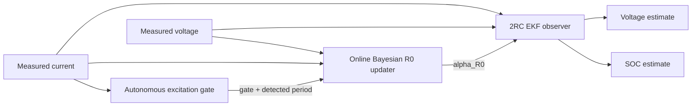

# MJ1 Adaptive 2RC–EKF SOC Estimation

**Experimentally parameterised battery modelling, EKF state estimation, autonomous excitation detection, and gated online Bayesian R0 adaptation for the LG INR18650 MJ1 in MATLAB and Simulink.**

This repository extends a frozen SOC-dependent 2RC Thevenin EKF baseline with two additional layers:

- an autonomous current-based excitation gate; and
- a causal online Bayesian update of the ohmic-resistance multiplier.

The frozen state-transition model and RC dynamics remain unchanged.

Post-release extension tracks deliberately test whether additional estimator or adaptation complexity is justified; unsuccessful candidates and negative transfer results are retained as evidence rather than promoted.

[Adaptive v1 validation](docs/validation/adaptive_v1_validation.md) · [K=4 extension closeout](docs/validation/ext1_k4_candidate_closeout.md) · [EXT2 dynamic-parameter qualification](docs/validation/ext2_dynamic_parameter_adaptation_closeout.md) · [Frozen-EKF validation](docs/validation/A8c_validation_report.md) · [Model-selection analysis](docs/validation/A8c_candidate_decision.md) · [Reproduction guide](docs/validation/A8c_reproduction.md)

## Current qualification status

| Component / candidate | Public status |
|---|---|
| Frozen SOC-dependent 2RC-EKF | Validated baseline |
| Gated Bayesian `R0` adaptation | **Qualified within released v1.0 scope** |
| EXT1 K=4 rolling posterior | Closed extension candidate; **not v1.1** |
| Continuous `R1/tau1` adaptation | **Not qualified** |
| Continuous `R2/tau2` adaptation | **Not qualified — closed** |
| Simultaneous dynamic4 adaptation | **Not qualified** |
| HPPC pulse+relaxation re-identification | Future event-based / batch candidate |

EXT2's central result is that **identifiability does not automatically imply a transferable online adaptation target**.
## Architecture

The adaptive layer changes only the ohmic-resistance contribution used by the EKF measurement model:

`R0*(SOC) = alpha_R0 × R0(SOC)`

When the gate is closed, `alpha_R0 = 1`, so the adaptive estimator falls back numerically to the frozen EKF.

## Key v1.0 result

The released v1.0 development condition is a fast periodic DC–AC excitation with measured frequency approximately **0.144 Hz** and period approximately **6.96 s**.

| Metric | Frozen EKF | Autonomous adaptive EKF |
|---|---:|---:|
| Posterior-voltage RMSE, 20–80% SOC | 4.021863 mV | **3.805565 mV** |
| Relative RMSE change | — | **−5.378%** |
| Approx. squared-error reduction | — | **10.5%** |
| Final alpha_R0 | 1.000000 | **1.018477** |
| Accepted online updates | 0 | **50** |

The adaptive layer reduced the fast-condition posterior-voltage RMSE by **5.378%** while leaving the physical plant/state-transition path unchanged.

## How v1.0 adaptation works

1. The measured current is analysed online by the excitation gate.
2. Parameter learning is allowed only when the excitation satisfies the validated fast-excitation conditions.
3. The Bayesian updater estimates a scalar multiplier `alpha_R0`.
4. The EKF measurement model uses `R0*(SOC) = alpha_R0 × R0(SOC)`.
5. If the excitation is not sufficiently informative, the gate stays closed and the estimator remains identical to the frozen baseline.

The gate uses a rolling current window, linear detrending, spectral concentration tests, a fast-branch frequency criterion, and open/close hysteresis. Full implementation details and exact validation plots are in the [Adaptive v1 validation report](docs/validation/adaptive_v1_validation.md).

## v1.0 fail-safe behaviour

The final v1.0 A/B matrix contains nine real conditions.

| Condition family | Measured frequency / period | Gate | Online R0 update |
|---|---|---|---|
| Fast periodic development case | ≈0.144 Hz / ≈6.96 s | Open | **50 updates** |
| Slow periodic, three amplitudes | ≈0.0143 Hz / ≈70 s | Closed | 0 |
| Slow periodic, three amplitudes | ≈0.00143 Hz / ≈700 s | Closed | 0 |
| Ultra-low-frequency | ≈0.000412 Hz / ≈2427 s | Closed | 0 |
| Constant-current holdout | No finite excitation period | Closed | 0 |

Across all eight non-fast conditions:

- gate-open fraction remained zero;
- update count remained zero;
- `alpha_R0` remained exactly 1 within numerical precision;
- plant outputs were unchanged; and
- the adaptive estimator numerically collapsed to the frozen EKF.

The reviewed final real-condition matrix is **9/9 PASS**.

## v1.0 sensor-bias robustness

The released v1.0 architecture was stress-tested on its development dataset with:

- current offsets: **±10 mA, ±20 mA**;
- voltage offsets: **±5 mV, ±10 mV**.

All nine cases, including the unbiased baseline, passed the stated v1.0 robustness checks.

The maximum absolute shift in final `alpha_R0` was approximately **1.96 × 10⁻⁴**, and the maximum update-count shift was **1**.

Current and voltage offsets are robustness stressors in v1.0; they are not augmented EKF states.

## Extension Track 1 — finite posterior memory

Extension Track 1 investigated a failure of the frozen v1.0 cumulative Bayesian memory under an additional high-amplitude fast condition. The released v1.0 implementation was not modified.

A rolling-posterior family with memory lengths `K = {1, 2, 4, 8, 16, 32}` accepted windows was evaluated. After inspecting the sweep, the extension selection rule was defined as:

> choose the **largest finite K** that preserves plant invariance, does not degrade any current A/B/C case relative to the Frozen EKF, and does not degrade the formal A/B cases relative to the original v1.0 adaptive estimator.

Under that **post-sweep, non-preregistered** rule, `K=4` was selected.

### Aggregate K=4 evidence

| Case | Role | K4 vs Frozen | K4 vs frozen v1.0 |
|---|---|---:|---:|
| A: 0.2C + 0.3C, fast band | Formal native case | **−1.917%** | **−0.518%** |
| B: 0.3C + 0.4C, fast band | Formal native case | **−1.725%** | **−1.522%** |
| C: 0.2C + 0.8C, fast band | Sensitivity-only case | **−0.403%** | **−2.094%** |

The K=4 standalone core, integrated Simulink implementation, plant invariance, and gate-closed fail-safe behaviour all reached numerical parity with their corresponding reference calculations.

### Evidence that prevents promotion to v1.1

K=4 remains a **frozen extension candidate**, not an independently validated release.

- The predeclared K=4 sensor-bias qualification remains **FAIL** because Case A at ±20 mA produced an update-count shift of −2 against the predefined `|ΔN| ≤ 1` criterion. Later diagnostics do not rewrite that verdict.
- An archived raw 0.3C + 0.7C candidate (`EXP_0037`) was shown to contain the complete development electrical sequence sample-for-sample and is therefore not an independent physical holdout.
- No untouched independent fast-band holdout remains available in the current archive.
- Leave-one-condition-out selection stability is **2/3 PASS**. When Case C is hidden, A+B select `K=8`; that K degrades the held-out C condition by **+0.381%** versus Frozen.
- Case C is sensitivity-only because its replay-ready record ends at approximately **78.07% SOC**, not the complete 20–80% band.

### SOC-local limitation

The aggregate Case-C improvement is not uniform across SOC. Five-percentage-point analysis shows sustained local degradation beginning around **55% SOC**:

- 55–60%: **+29.39%** vs Frozen;
- 60–65%: **+45.59%** vs Frozen;
- 65–70%: **+2.74%** vs Frozen;
- 70–75%: **+7.47%** vs Frozen;
- 75–78.07%: **+40.74%** vs Frozen.

The strongest local regression occurs at 60–65% SOC.

### Mechanistic closeout

A fixed-state conditional-alpha oracle shows that the high-SOC Case-C K=4 multiplier is systematically above the value that minimizes posterior-voltage error on the realized EKF state path. Over accepted windows at ≥55% SOC:

- mean shadow-window alpha ≈ **1.01453**;
- mean EKF conditional-oracle alpha ≈ **1.00031**;
- mean shadow-minus-oracle divergence ≈ **+0.01422**;
- **96.55%** of windows have shadow alpha above the EKF conditional oracle.

This shadow-to-EKF target mismatch is **not unique to Case C**; related divergence is also present in A/B. Case C becomes problematic because the realized correction energy can exceed the residual-cancellation benefit.

Exact per-bin SSE decomposition gives:

`SSE_K4 − SSE_Frozen = 2 e_Frozenᵀ ΔV + ||ΔV||²`

The cross term measures whether the correction cancels or reinforces the pre-existing residual; the quadratic term is the correction-energy cost. In Case C:

- 55–60% SOC includes material state-path degradation;
- approximately 60–75% SOC is dominated by alpha-layer over-correction that reverses otherwise beneficial state-path effects;
- near 75–78% SOC both state-path and adaptive-layer contributions become unfavourable.

These oracle and decomposition results are **diagnostic counterfactuals**, not independently validated controller redesigns.

Full scope and evidence boundaries are documented in [EXT1 K=4 candidate closeout](docs/validation/ext1_k4_candidate_closeout.md).

## Extension Track 2 — dynamic-parameter adaptation qualification

Extension Track 2 investigated whether dynamic RC parameters beyond the released gated `R0` path should be adapted continuously online.

The qualification parameterization was `theta = [R0, R1, tau1, R2, tau2]`, with `tau_i = R_i C_i`.

### Parameter qualification

- `R1/tau1`: **not qualified for continuous online adaptation**; practical information under the available periodic excitation was too weak for robust continuous estimation.
- `R2/tau2`: synthetic recovery and practical identifiability were promising under suitable MID/SLOW excitation, but the measured optimum was not stable across SOC, frequency, and excitation amplitude. The continuous candidate is therefore **closed**.
- simultaneous `R1/tau1/R2/tau2` adaptation: **not qualified**. Dedicated HPPC pulse+relaxation remains a future event-based / batch re-identification route.

### Charging-baseline model-form evidence

An independently derived low-rate charging-baseline correction improved **18/18** selected DC-AC validation windows: median RMSE **36.940 → 7.621 mV**, with **85.98%** median absolute-bias reduction.

This is strong **condition-compatible model-form evidence**, not a universal charge-OCV correction or proof of electrochemical hysteresis.

### Full-trajectory transfer

Prospective evaluation on the historical 1C full-charge trajectory over approximately 17–85% SOC produced RMSE **23.165 → 19.286 mV** (**16.75%** improvement), while centered RMSE worsened **8.638 → 12.543 mV**. All seven prospective transfer gates failed.

The correction is therefore **not promoted to a universal charge-direction OCV branch**.

### SOC-axis and provenance audits

C1A reproduced the FROZEN-QREF C1 result with **0 mV parity error**. The best alternate convention, `NOMINAL_3P5`, improved corrected full-trajectory RMSE over `FROZEN_QREF` by only **6.27%**. Final classification: `SOC_AXIS_MAPPING_NOT_PRIMARY`.

Historical HPPC absolute-SOC provenance remains **INCONCLUSIVE**; the frozen LUT SOC nodes are not relocated.

> **Identifiable does not necessarily mean transferable as an online adaptation target.**

[Full EXT2 qualification closeout](docs/validation/ext2_dynamic_parameter_adaptation_closeout.md)
## Frozen 2RC–EKF baseline

The adaptive architecture preserves the previously validated frozen estimator.

The reference baseline benchmark uses a measured **1C discharge at −3.4 A**, sampled every **1 s**, covering approximately **50% to 17% SOC**.

| Initial SOC condition | SOC RMSE [pp] | Posterior-voltage RMSE [mV] |
|---|---:|---:|
| Correct initialization | **2.445** | **10.182** |
| −20 pp offset | 2.509 | 10.925 |
| +15 pp offset | 2.455 | 11.187 |

SOC errors are evaluated against a Coulomb-counting consistency reference, **not an independent SOC ground truth**.

MATLAB and Simulink implementations were also checked for numerical agreement under constant-current and synthetic variable-current step tests.

## Model

| Configuration | Value |
|---|---|
| Cell | LG INR18650 MJ1 |
| Nominal capacity | 3.5 Ah |
| Model reference capacity | 3.335 Ah |
| Frozen lookup-table SOC interval | 17–85% |
| Current convention | Positive for charge; negative for discharge |
| State order | `[v1, v2, SOC]` |
| Reference sampling interval | 1 s |

The frozen EKF uses numerical Jacobians, Joseph-form covariance updates, and SOC-bound enforcement.

| EKF setting | Reference value |
|---|---|
| Process covariance | `diag([1e-7, 1e-7, 1e-9])` |
| Voltage measurement covariance | `(0.020 V)^2` |
| Initial state covariance | `diag([0.02^2, 0.02^2, 0.20^2])` |

## Frequency descriptions

Historical tau-labels are retained only as dataset aliases. Public technical descriptions use measured frequency and period.

| Historical alias | Public description |
|---|---|
| `0.1τ` | fast-band, ≈0.144 Hz, ≈6.96 s |
| `1τ` | slow-band, ≈0.0143 Hz, ≈70 s |
| `10τ` | slow-band, ≈0.00143 Hz, ≈700 s |
| ULF | ultra-low-frequency, ≈0.000412 Hz, ≈2427 s |

## Repository contents

| Directory | Contents |
|---|---|
| `data/` | Frozen model lookup tables and benchmark data |
| `matlab/` | EKF equations, Jacobians, v1.0 Bayesian updater/gate, and the K=4 extension core |
| `model/` | Frozen plant/EKF models, released v1.0 adaptive model, and K=4 extension-candidate model |
| `figures/validation/` | Detailed validation plots |
| `docs/validation/` | Validation methods, evidence boundaries, EXT1 closeout, and EXT2 dynamic-parameter qualification |
| `scripts/extension_track2/` | Final reviewed EXT2 analysis-source snapshots; see its README for reproducibility boundaries |
| `results/adaptive_v1/` | Reviewed frozen-v1.0 A/B and sensor-bias evidence |
| `results/extension_track1/` | K=4 model-selection, robustness, limitation, and mechanism evidence |
| `results/extension_track2/` | Curated EXT2 qualification summaries, reports, and diagnostic figures |
| `results/validation/` | Archived frozen-EKF validation evidence |
| `tools/` | Offline evidence-verification utilities |

## Current limitations

The evidence supports **same-frequency cross-amplitude transfer of frozen v1.0 on two independent native fast cases**, but **independent cross-frequency fast-band generalization has not been demonstrated**.

For the K=4 extension candidate, A/B/C are consumed development/model-selection evidence. No untouched independent fast-band holdout remains available in the current archive.

Other scope boundaries:

- the Coulomb-counting SOC reference is not independent SOC ground truth;
- the autonomous gate is validated for the project's periodic/sinusoidal excitation family, not arbitrary automotive drive cycles;
- K=4 does not provide uniform SOC-local improvement under the high-amplitude sensitivity case;
- the K=4 predeclared sensor-bias qualification remains failed even though later output-impact attribution limits the engineering significance of that failure;
- unconditional all-timescale scalar-R0 adaptation is not supported;
- cross-cell and temperature generalization have not been demonstrated;
- current and voltage biases are stressors, not online estimated states.

Additional EXT2 boundaries:

- continuous dynamic RC adaptation beyond the released gated `R0` path is not qualified by the current evidence;
- the B1-2H charging-baseline correction is local/condition-compatible rather than a universal OCV or hysteresis branch;
- historical HPPC absolute-SOC provenance remains inconclusive;
- SOC-axis convention is not the primary explanation of the C1 full-trajectory transfer failure; and
- EXT2 remains based on the same historical single-cell evidence family; cross-cell and temperature generalization remain untested.
## Future work

Extension Track 1 is closed without promotion to v1.1.

The historical-data EXT2 dynamic-parameter qualification track is also closed. Continuous `R2/tau2` adaptation is not promoted from the current evidence.

The v1.0 development case and EXT1 A/B/C cases remain consumed development/model-selection evidence. They should not be retuned and reused as if they were independent validation.

The same discipline now applies to EXT2: the historical single-cell archive should not be mined repeatedly for new post-hoc correction forms and then reused as nominally independent proof of those corrections.

Dynamic-parameter adaptation should be reopened only with new controlled evidence, preferably including:

- multiple fresh LG INR18650 MJ1 cells;
- controlled chamber temperature;
- continuous authoritative current logging;
- explicit full and empty SOC anchors;
- low-rate charge and discharge OCV characterization;
- multiple C-rate full trajectories;
- a new HPPC pulse+relaxation campaign; and
- at least one independent holdout cell.

Cross-frequency, temperature, cross-cell, and independent fast-band generalization therefore remain open research questions.
## Author

**Jiaxing Lu** — battery testing, modelling, diagnostics, and BMS-oriented state estimation.

For data terms, see [DATA_LICENSE.md](DATA_LICENSE.md).
