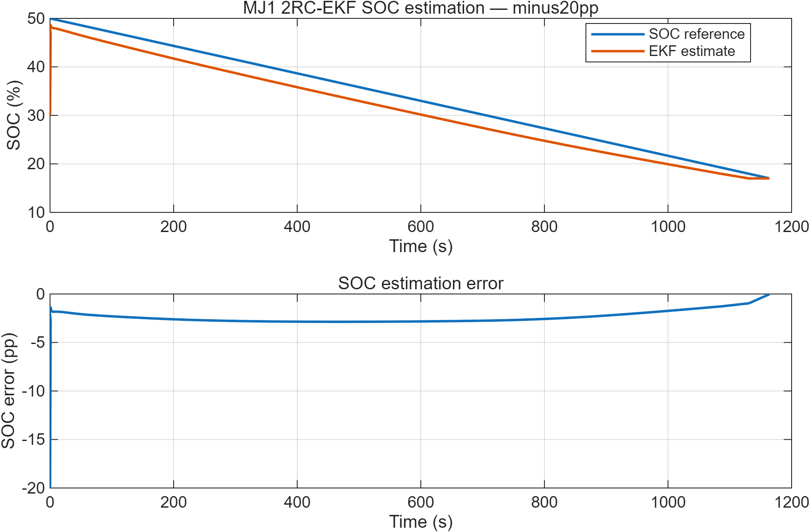
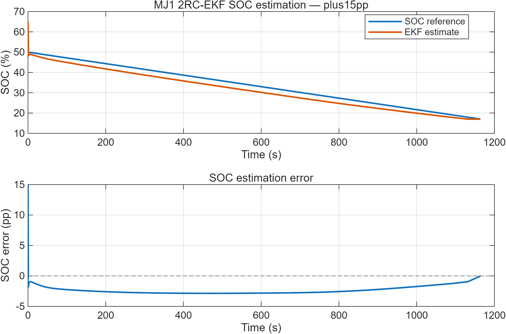

# MJ1 2RC EKF SOC Estimation

Experimentally parameterised second-order Thevenin equivalent-circuit model and Extended Kalman Filter (EKF) for lithium-ion battery State-of-Charge (SOC) estimation.

The project is based on LG INR18650 MJ1 cell test data and provides a reproducible workflow from parameterised 2RC modelling to MATLAB/Simulink EKF implementation and validation.

---

## Project Scope

This repository contains:

- a SOC-dependent second-order Thevenin model,
- exact discrete-time RC dynamics,
- an EKF-based SOC estimator,
- a MATLAB reference implementation,
- Simulink plant and EKF implementations,
- validation against a held-out experimental discharge segment,
- initial-SOC mismatch robustness tests,
- Python-to-MATLAB numerical benchmark comparison.

The present version focuses on **SOC estimation**.

It does **not** yet implement SOH estimation, degradation-state estimation, temperature adaptation, or aging-aware parameter evolution.

---

## Cell and Sign Convention

Cell:

- LG INR18650 MJ1
- nominal capacity: 3.5 Ah
- reference capacity used in the current model: 3.335 Ah

Current sign convention:

- `I > 0`: charge
- `I < 0`: discharge

---

## 2RC Thevenin Model

The state vector is

$$
x =
\begin{bmatrix}
v_1 \\
v_2 \\
SOC
\end{bmatrix}
$$

with discrete-time dynamics

$$
v_{1,k+1}=a_1v_{1,k}+b_1I_k
$$

$$
v_{2,k+1}=a_2v_{2,k}+b_2I_k
$$

$$
SOC_{k+1}=SOC_k+\frac{I_k\Delta t}{3600Q_{\mathrm{ref}}}
$$

where

$$
a_i=\exp\left(-\frac{\Delta t}{R_iC_i}\right)
$$

and

$$
b_i=R_i(1-a_i)
$$

The terminal-voltage model is

$$
V_k=OCV(SOC_k)+v_{1,k}+v_{2,k}+R_0(SOC_k)I_k
$$

The parameters

$$
R_0,\;R_1,\;C_1,\;R_2,\;C_2,\;OCV
$$

are represented as SOC-dependent lookup tables.

---

## Parameterisation

The current v0.2 model is based on HPPC-derived second-order RC parameters and a small correction using 0.5C steady-polarisation information.

The model is considered valid over approximately:

$$
SOC \in [17\%,85\%]
$$

The validation interval used for the EKF benchmark is approximately:

$$
SOC: 50\% \rightarrow 17\%
$$

The OCV map used in this project is an empirical pseudo-OCV surrogate rather than a fully relaxed equilibrium OCV curve.

---

## Extended Kalman Filter

The EKF estimates the three states:

$$
[v_1,\;v_2,\;SOC]^T
$$

using measured current and terminal voltage.

The implementation includes:

- nonlinear SOC-dependent lookup tables,
- numerical Jacobians,
- Joseph-form covariance update,
- SOC boundary enforcement,
- exact discrete-time RC state propagation.

Reference tuning in the current implementation:

$$
Q = \mathrm{diag}(10^{-7},10^{-7},10^{-9})
$$

$$
\sigma_V = 20\ \mathrm{mV}
$$

$$
R = \sigma_V^2
$$

with

$$
\Delta t = 1\ \mathrm{s}
$$

---

## Simulink Implementation

Two verified Simulink models are included:

- `MJ1_2RC_EKF_v02_S1_PlantVerified.slx`
- `MJ1_2RC_EKF_v02_S2_Final.slx`

### Stage S1 - Plant Verification

The Simulink 2RC plant was verified against the MATLAB/Python reference implementation.

Holdout voltage-model result:

| Metric | Result |
|---|---:|
| Voltage RMSE | 17.351 mV |
| Mean residual | -14.171 mV |
| Maximum absolute residual | 22.898 mV |

The Simulink and Python results differ by approximately 0.002 mV in voltage RMSE.

### Stage S2 - EKF Validation

The EKF was evaluated using three SOC initialisation cases.

| Case | SOC RMSE [pp] | SOC MAE [pp] | Max abs. error [pp] | Final SOC error [pp] | Voltage RMSE [mV] |
|---|---:|---:|---:|---:|---:|
| Correct initial SOC | 2.445 | 2.374 | 2.868 | -0.025 | 10.182 |
| Initial SOC -20 pp | 2.509 | 2.385 | 20.000 | -0.025 | 10.925 |
| Initial SOC +15 pp | 2.455 | 2.349 | 15.000 | -0.025 | 11.187 |

`pp` denotes percentage points.

The tested initial-SOC mismatch cases converge to essentially the same long-term trajectory.

This result should not be interpreted as universal convergence behaviour outside the tested dataset and model range.

---

## Python-MATLAB Consistency

The MATLAB implementation was checked against a frozen Python benchmark.

Typical discrepancies are on the order of:

- approximately 0.0002 percentage points in SOC metrics,
- approximately 0.003 mV in voltage RMSE.

The frozen benchmark is stored in:

`data/expected_python_benchmark.json`

---

## Validation Figures

### Correct Initial SOC

### Initial SOC -20 Percentage Points

### Initial SOC +15 Percentage Points

---

## Repository Structure

~~~text
MJ1_2RC_EKF_SOC_Estimation/
├── data/
├── docs/
├── figures/
├── matlab/
├── model/
├── results/
├── scripts/
├── .gitattributes
├── .gitignore
└── README.md
~~~

### `data/`

Model LUTs, MATLAB model data, holdout dataset, and frozen Python benchmark.

### `matlab/`

MATLAB EKF implementation, state-transition and measurement functions, Jacobians, interpolation utilities, and benchmark checking.

### `model/`

Verified Simulink plant and EKF models.

### `results/`

Numerical EKF validation metrics and time-domain traces.

### `figures/`

SOC-estimation validation figures.

### `scripts/`

Post-processing and validation-summary generation scripts.

### `docs/`

Simulink implementation documentation.

---

## Reproducibility

A typical MATLAB workflow is:

~~~matlab
addpath("matlab")

load("data/mj1_v02_model.mat")
load("data/mj1_holdout_50to17.mat")

run("matlab/run_mj1_ekf_holdout.m")
run("matlab/check_against_python_benchmark.m")
~~~

The Simulink models use a 1 s fixed-step discrete configuration.

---

## Current Limitations

The present version has several deliberate boundaries:

- validation is limited to the current LG MJ1 experimental dataset,
- model use should remain within approximately 17-85% SOC,
- the reported EKF holdout validation covers approximately 50-17% SOC,
- the OCV map is a pseudo-OCV surrogate,
- no explicit temperature dependence is included,
- no aging-dependent parameter adaptation is included,
- no SOH or degradation-state estimator is implemented yet.

---

## Planned Extensions

Future work may include:

- temperature-dependent ECM parameters,
- aging-dependent parameter evolution,
- adaptive process and measurement covariance,
- SOH / SoX estimation,
- observer robustness analysis,
- coupling with experimentally derived degradation indicators.

---

## Author

**Jiaxing Lu**

Battery modelling, testing, diagnostics, and BMS-oriented state estimation.

