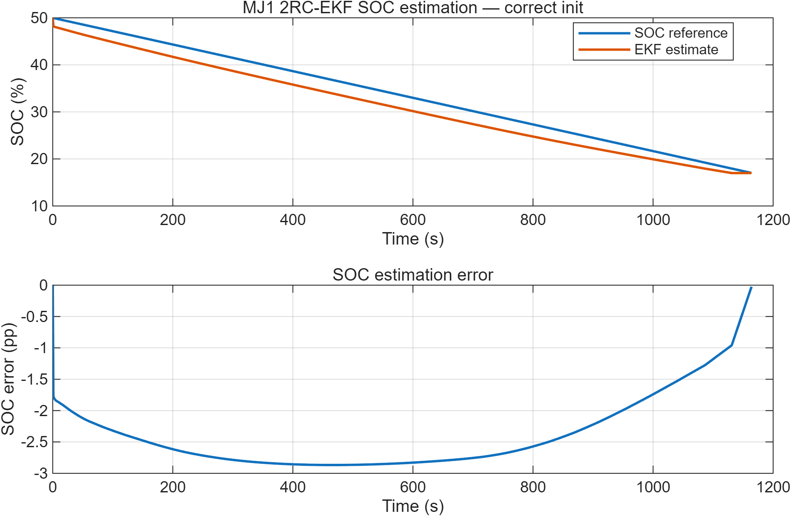

# MJ1 2RC EKF SOC Estimation

**Experimentally parameterised battery modelling and state-of-charge estimation in MATLAB and Simulink.**

This project combines an SOC-dependent second-order Thevenin model with an extended Kalman filter (EKF) for the LG INR18650 MJ1 lithium-ion cell. It connects HPPC-based parameterisation, measured current and voltage, state estimation, and reproducible implementation testing.

The repository extends [MJ1 2RC Thevenin Model Validation](https://github.com/jiaxingLu/MJ1_2RC_Thevenin_Model_Validation) from local, fixed-SOC model validation to an SOC-dependent estimator.

[Validation report](docs/validation/A8c_validation_report.md) · [Model-selection analysis](docs/validation/A8c_candidate_decision.md) · [Reproduction guide](docs/validation/A8c_reproduction.md)

## Results

The reference benchmark uses a measured 1C discharge segment at **-3.4 A**, sampled every **1 s**, covering approximately **50% to 17% SOC**. Three initial-SOC conditions are evaluated on the same 1165-sample record.

| Initial SOC condition | SOC RMSE [pp] | Posterior-voltage RMSE [mV] |
|---|---:|---:|
| Correct initialization | **2.445** | **10.182** |
| -20 pp offset | 2.509 | 10.925 |
| +15 pp offset | 2.455 | 11.187 |

SOC errors are measured against the experimental Coulomb-counting reference; `pp` denotes percentage points.

**MATLAB-Simulink agreement:** SOC, posterior voltage, and voltage innovation agree within the specified numerical tolerances for all three initializations. The verification includes 40 baseline-regression checks and 15 signal checks, with every sample retained. Detailed tolerances and comparison traces are provided in the [validation report](docs/validation/A8c_validation_report.md#implementation-agreement).



[View the -20 pp test](figures/SOC_convergence_minus20pp.png) · [View the +15 pp test](figures/SOC_convergence_plus15pp.png)

## Model and estimator

The cell model represents instantaneous voltage drop and two polarization time scales using an ohmic resistance and two parallel RC branches. OCV, resistance, and capacitance are stored as SOC-dependent lookup tables.

| Configuration | Value |
|---|---|
| Cell | LG INR18650 MJ1 |
| Nominal capacity | 3.5 Ah |
| Model reference capacity | 3.335 Ah |
| Lookup-table SOC interval | 17-85% |
| Current convention | Positive for charge; negative for discharge |
| State order | `[v1, v2, SOC]` |
| Benchmark sampling interval | 1 s |

For each RC branch, parameters are held constant over a discrete step:

$$
v_{i,k+1}=a_i v_{i,k}+R_i(1-a_i)I_k,
\qquad a_i=\exp\!\left(-\frac{\Delta t}{R_iC_i}\right).
$$

SOC propagation and terminal voltage follow

$$
SOC_{k+1}=SOC_k+\frac{I_k\Delta t}{3600Q_{\mathrm{ref}}},
$$

$$
V_k=OCV(SOC_k)+v_{1,k}+v_{2,k}+R_0(SOC_k)I_k.
$$

The parameter set combines HPPC-derived RC parameters with a correction based on 0.5C steady-polarization data. The OCV map is an empirical pseudo-OCV surrogate rather than a fully relaxed equilibrium curve.

The EKF uses numerical Jacobians, Joseph-form covariance updates, and SOC boundary enforcement. Parameters follow the frozen SOC lookup tables; online parameter adaptation is not active.

| EKF setting | Reference value |
|---|---|
| Process covariance | `diag([1e-7, 1e-7, 1e-9])` |
| Voltage measurement covariance | `(0.020 V)^2` |
| Initial state covariance | `diag([0.02^2, 0.02^2, 0.20^2])` |

## Run the MATLAB benchmark

The documented test environment is MATLAB R2025b Update 2 and Simulink R2025b on Windows 10. Simulink is required for the `.slx` models; the MATLAB reference EKF uses MATLAB functions without additional toolbox dependencies.

From the repository root in MATLAB:

```matlab
addpath(fullfile(pwd, "matlab"), fullfile(pwd, "data"))
run("matlab/run_mj1_ekf_holdout.m")
run("matlab/check_against_python_benchmark.m")
```

The benchmark reports estimation metrics and produces SOC and voltage comparisons. Simulink models are provided separately in `model/`; their initialization and signal interfaces are described in the [implementation guide](docs/SIMULINK_IMPLEMENTATION_PLAN.md).

The published comparison data can also be checked without MATLAB using Python 3.9 or later:

```bash
python tools/verify_a8c_evidence.py
```

This command verifies file integrity and recomputes the archived metrics; it does not execute the Simulink models. See the [reproduction guide](docs/validation/A8c_reproduction.md) for the distinction between numerical evidence checks and fresh simulation runs.

## Repository contents

| Directory | Contents |
|---|---|
| `data/` | Model lookup tables, benchmark data, and frozen Python reference |
| `matlab/` | EKF, state and measurement equations, interpolation, and Jacobians |
| `model/` | Simulink 2RC plant and EKF observer |
| `figures/` | SOC-estimation comparison plots |
| `scripts/` | Validation-summary and post-processing utilities |
| `docs/validation/` | Test methods, results, model selection, and reproduction guidance |
| `results/validation/A8c/` | Archived metrics, reference arrays, and output-comparison traces |
| `tools/` | Offline evidence-verification utility |

## Validation scope

The results characterize this cell dataset and the stated operating range. The Coulomb-counting reference is not an independent SOC measurement, and implementation agreement is distinct from physical estimation accuracy. The final portion of the benchmark reaches the 17% lower SOC bound; the near-zero endpoint error is therefore not used as a convergence result.

The current runtime comparison covers fixed-step, constant-current operation. Variable-current timing, temperature and aging generalization, and embedded deployment are outside the demonstrated scope. Supporting analyses and individual test boundaries are documented in [validation coverage](docs/validation/A8c_claim_evidence.md).

## Author

**Jiaxing Lu** — battery testing, modelling, diagnostics, and BMS-oriented state estimation.

For data terms, see [DATA_LICENSE.md](DATA_LICENSE.md).
