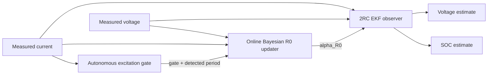

# MJ1 Adaptive 2RC–EKF SOC Estimation

**Experimentally parameterised battery modelling, EKF state estimation, autonomous excitation detection, and gated online Bayesian R0 adaptation for the LG INR18650 MJ1 in MATLAB and Simulink.**

This repository extends a frozen SOC-dependent 2RC Thevenin EKF baseline with two additional layers:

- an autonomous current-based excitation gate; and
- a causal online Bayesian update of the ohmic-resistance multiplier.

The frozen state-transition model and RC dynamics remain unchanged.

[Adaptive v1 validation](docs/validation/adaptive_v1_validation.md) · [Frozen-EKF validation](docs/validation/A8c_validation_report.md) · [Model-selection analysis](docs/validation/A8c_candidate_decision.md) · [Reproduction guide](docs/validation/A8c_reproduction.md)

## Architecture

The adaptive layer changes only the ohmic-resistance contribution used by the EKF measurement model:

`R0*(SOC) = alpha_R0 × R0(SOC)`

When the gate is closed, `alpha_R0 = 1`, so the adaptive estimator falls back numerically to the frozen EKF.

## Key result

The current v1.0 development condition is a fast periodic DC–AC excitation with measured frequency approximately **0.144 Hz** and period approximately **6.96 s**.

| Metric | Frozen EKF | Autonomous adaptive EKF |
|---|---:|---:|
| Posterior-voltage RMSE, 20–80% SOC | 4.021863 mV | **3.805565 mV** |
| Relative RMSE change | — | **−5.378%** |
| Approx. squared-error reduction | — | **10.5%** |
| Final alpha_R0 | 1.000000 | **1.018477** |
| Accepted online updates | 0 | **50** |

The adaptive layer therefore reduced the fast-condition posterior-voltage RMSE by **5.378%** while leaving the physical plant/state-transition path unchanged.

## How adaptation works

1. The measured current is analysed online by the excitation gate.
2. Parameter learning is allowed only when the excitation satisfies the validated fast-excitation conditions.
3. The Bayesian updater estimates a scalar multiplier `alpha_R0`.
4. The EKF measurement model uses `R0*(SOC) = alpha_R0 × R0(SOC)`.
5. If the excitation is not sufficiently informative, the gate stays closed and the estimator remains identical to the frozen baseline.

The gate uses a rolling current window, linear detrending, spectral concentration tests, a fast-branch frequency criterion, and open/close hysteresis. Full implementation details and exact validation plots are in the [Adaptive v1 validation report](docs/validation/adaptive_v1_validation.md).

## Fail-safe behaviour

The final A/B matrix contains nine real conditions.

| Condition family | Measured frequency / period | Gate | Online R0 update |
|---|---|---|---|
| Fast periodic development case | ≈0.144 Hz / ≈6.96 s | Open | **50 updates** |
| Slow periodic, three amplitudes | ≈0.0143 Hz / ≈70 s | Closed | 0 |
| Slow periodic, three amplitudes | ≈0.00143 Hz / ≈700 s | Closed | 0 |
| Ultra-low-frequency | ≈0.000412 Hz / ≈2427 s | Closed | 0 |
| Constant-current holdout | No finite excitation period | Closed | 0 |

Across all eight non-fast conditions:

- gate-open fraction remained zero;
- update count remained zero;
- `alpha_R0` remained exactly 1 within numerical precision;
- plant outputs were unchanged; and
- the adaptive estimator numerically collapsed to the frozen EKF.

The reviewed final real-condition matrix is **9/9 PASS**.

## Sensor-bias robustness

The final closed-loop architecture was stress-tested with:

- current offsets: **±10 mA, ±20 mA**;
- voltage offsets: **±5 mV, ±10 mV**.

All nine cases, including the unbiased baseline, passed the stated robustness checks.

The maximum absolute shift in final `alpha_R0` was approximately **1.96 × 10⁻⁴**, and the maximum update-count shift was **1**.

Current and voltage offsets are robustness stressors in v1.0; they are not augmented EKF states.

## Frozen 2RC–EKF baseline

The adaptive architecture preserves the previously validated frozen estimator.

The reference baseline benchmark uses a measured **1C discharge at −3.4 A**, sampled every **1 s**, covering approximately **50% to 17% SOC**.

| Initial SOC condition | SOC RMSE [pp] | Posterior-voltage RMSE [mV] |
|---|---:|---:|
| Correct initialization | **2.445** | **10.182** |
| −20 pp offset | 2.509 | 10.925 |
| +15 pp offset | 2.455 | 11.187 |

SOC errors are evaluated against a Coulomb-counting consistency reference, **not an independent SOC ground truth**.

MATLAB and Simulink implementations were also checked for numerical agreement under constant-current and synthetic variable-current step tests.

## Model

| Configuration | Value |
|---|---|
| Cell | LG INR18650 MJ1 |
| Nominal capacity | 3.5 Ah |
| Model reference capacity | 3.335 Ah |
| Frozen lookup-table SOC interval | 17–85% |
| Current convention | Positive for charge; negative for discharge |
| State order | `[v1, v2, SOC]` |
| Reference sampling interval | 1 s |

The frozen EKF uses numerical Jacobians, Joseph-form covariance updates, and SOC-bound enforcement.

| EKF setting | Reference value |
|---|---|
| Process covariance | `diag([1e-7, 1e-7, 1e-9])` |
| Voltage measurement covariance | `(0.020 V)^2` |
| Initial state covariance | `diag([0.02^2, 0.02^2, 0.20^2])` |

## Frequency descriptions

Historical tau-labels are retained only as dataset aliases. Public technical descriptions use measured frequency and period.

| Historical alias | Public description |
|---|---|
| `0.1τ` | fast-band, ≈0.144 Hz, ≈6.96 s |
| `1τ` | slow-band, ≈0.0143 Hz, ≈70 s |
| `10τ` | slow-band, ≈0.00143 Hz, ≈700 s |
| ULF | ultra-low-frequency, ≈0.000412 Hz, ≈2427 s |

## Repository contents

| Directory | Contents |
|---|---|
| `data/` | Frozen model lookup tables and benchmark data |
| `matlab/` | EKF equations, Jacobians, online Bayesian R0 updater, and autonomous excitation gate |
| `model/` | Frozen plant/EKF models and final autonomous adaptive Simulink model |
| `figures/validation/` | Detailed adaptive-v1 validation plots |
| `docs/validation/` | Validation methods, results, evidence boundaries, and reproduction notes |
| `results/adaptive_v1/` | Reviewed adaptive-v1 A/B and sensor-bias evidence |
| `results/validation/` | Archived frozen-EKF validation evidence |
| `tools/` | Offline evidence-verification utilities |

## Current limitations

**Independent fast-band generalization has not yet been demonstrated.**

The adaptive estimator has so far been developed and validated on one available fast periodic DC–AC condition with measured frequency approximately **0.144 Hz** and period approximately **6.96 s**. Additional fast-band frequencies and current amplitudes are required for independent validation.

Other scope boundaries:

- the Coulomb-counting SOC reference is not independent SOC ground truth;
- the autonomous gate is validated for the project's periodic/sinusoidal excitation family, not arbitrary automotive drive cycles;
- unconditional all-timescale scalar-R0 adaptation is not supported;
- cross-cell and temperature generalization have not yet been demonstrated;
- current and voltage biases are stress-tested but are not online estimated states in v1.0.

## Next extension

The next track is deliberately separated from v1.0:

1. independent additional fast-band DC–AC validation;
2. an oracle R0 performance-ceiling audit;
3. only then, evidence-driven consideration of SOC-dependent R0 scaling, constrained fast-RC parameter adaptation, or alternative state estimators.

## Author

**Jiaxing Lu** — battery testing, modelling, diagnostics, and BMS-oriented state estimation.

For data terms, see [DATA_LICENSE.md](DATA_LICENSE.md).
