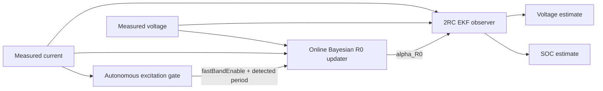

# MJ1 Adaptive 2RC–EKF SOC Estimation

**Experimentally parameterised battery modelling, EKF state estimation, autonomous excitation detection, and gated online Bayesian \(R_0\) adaptation in MATLAB and Simulink.**

This project develops an SOC-dependent second-order Thevenin equivalent-circuit model for the LG INR18650 MJ1 cell and uses it as the process model of an extended Kalman filter (EKF). The current v1.0 architecture extends the frozen EKF baseline with an autonomous excitation gate and a causal online Bayesian update of the ohmic-resistance map.

The repository builds on [MJ1 2RC Thevenin Model Validation](https://github.com/jiaxingLu/MJ1_2RC_Thevenin_Model_Validation) and preserves the previously validated frozen 2RC–EKF implementation as the baseline.

[Adaptive v1 validation](docs/validation/adaptive_v1_validation.md) · [Frozen-EKF validation](docs/validation/A8c_validation_report.md) · [Model-selection analysis](docs/validation/A8c_candidate_decision.md) · [Reproduction guide](docs/validation/A8c_reproduction.md)

## Architecture

The adaptive measurement model is

\[
V_k=OCV(SOC_k)+v_{1,k}+v_{2,k}+\alpha_{R0}R_0(SOC_k)I_k.
\]

Only the \(R_0\) contribution in the EKF measurement layer is adapted. The state-transition model and frozen RC dynamics are unchanged.

## Adaptive v1 result

The validated fast-excitation development condition has a measured excitation frequency of approximately

\[
f\approx0.144\ \mathrm{Hz},
\qquad
T\approx6.96\ \mathrm{s}.
\]

The historical experiment alias for this record is `0.1τ`; measured frequency and period are used as the primary public description.

For this condition:

| Metric | Frozen EKF | Autonomous adaptive EKF |
|---|---:|---:|
| Posterior-voltage RMSE, 20–80% SOC | 4.021863 mV | **3.805565 mV** |
| Relative RMSE change | — | **-5.378%** |
| Approx. squared-error reduction | — | **10.5%** |
| Final \(\alpha_{R0}\) | 1.000000 | **1.018477** |
| Accepted online updates | 0 | **50** |

The online Bayesian updater is causal and sample-by-sample. In the integrated Simulink regression, its \(\alpha_{R0}\), posterior uncertainty, update pulse, and update count reproduced the standalone validated core to numerical precision.

## Autonomous excitation gate

The fast-branch reference time constant is approximately

\[
\tau_{1,\mathrm{ref}}\approx3.2324\ \mathrm{s},
\]

corresponding to

\[
T_c=2\pi\tau_1\approx20.31\ \mathrm{s}.
\]

The autonomous detector uses a rolling current window, linear detrending, frequency-domain concentration tests, and the fast-branch criterion \(\omega\tau_1\ge1\). It is designed to prevent parameter learning when the current trajectory does not provide the required excitation.

### Frequency descriptions

Historical \(\tau\)-labels are retained only as dataset aliases. Public technical descriptions use measured frequency and period.

| Historical alias | Public description |
|---|---|
| `0.1τ` | fast-band, \(f\approx0.144\) Hz, \(T\approx6.96\) s |
| `1τ` | slow-band, \(f\approx0.0143\) Hz, \(T\approx70\) s |
| `10τ` | slow-band, \(f\approx0.00143\) Hz, \(T\approx700\) s |
| ULF | ultra-low-frequency, \(f\approx0.000412\) Hz, \(T\approx2427\) s |

## Fail-safe A/B validation

The final real-condition matrix contains nine conditions: one fast periodic condition, three approximately 70-s periodic conditions, three approximately 700-s periodic conditions, one ultra-low-frequency condition, and one constant-current holdout.

Only the fast condition enabled adaptation. In all eight slow, ultra-low-frequency, or constant-current conditions:

\[
\text{gate}=0,\qquad
\text{updates}=0,\qquad
\alpha_{R0}=1.
\]

The adaptive estimator therefore falls back numerically to the frozen EKF when the excitation gate is closed.

The reviewed final matrix is **9/9 PASS**. One original automated regression flag was caused only by a \(1.192\times10^{-9}\) percentage-point floating-point SOC difference against an unnecessarily strict \(1.0\times10^{-9}\) percentage-point equality threshold; the gate, update count, \(R_0\) multiplier, plant outputs, and voltage estimate were otherwise numerically identical. The review is documented in [Adaptive v1 validation](docs/validation/adaptive_v1_validation.md).

## Sensor-bias robustness

The closed-loop architecture was stress-tested with current offsets of \(\pm10\) and \(\pm20\) mA and voltage offsets of \(\pm5\) and \(\pm10\) mV. All nine cases, including the unbiased baseline, passed the robustness criteria.

The maximum absolute shift in the final \(R_0\) multiplier was approximately

\[
1.96\times10^{-4},
\]

and the maximum update-count change was one.

Current and voltage offsets are robustness stressors in v1.0; they are not augmented EKF states.

## Frozen 2RC–EKF baseline

The adaptive architecture preserves the previously validated frozen estimator.

The reference baseline benchmark uses a measured 1C discharge segment at **-3.4 A**, sampled every **1 s**, covering approximately **50% to 17% SOC**.

| Initial SOC condition | SOC RMSE [pp] | Posterior-voltage RMSE [mV] |
|---|---:|---:|
| Correct initialization | **2.445** | **10.182** |
| -20 pp offset | 2.509 | 10.925 |
| +15 pp offset | 2.455 | 11.187 |

SOC errors are measured against the experimental Coulomb-counting consistency reference; this is **not an independent SOC ground truth**.

MATLAB and Simulink implementations were also verified for numerical agreement under constant-current and synthetic variable-current step tests. See the [frozen-EKF validation report](docs/validation/A8c_validation_report.md) and [variable-current implementation check](docs/validation/current_step_parity.md).

## Model

The cell model represents the instantaneous ohmic voltage drop and two polarization time scales using one series resistance and two parallel RC branches. OCV, resistance, and capacitance are stored as SOC-dependent lookup tables.

| Configuration | Value |
|---|---|
| Cell | LG INR18650 MJ1 |
| Nominal capacity | 3.5 Ah |
| Model reference capacity | 3.335 Ah |
| Frozen lookup-table SOC interval | 17–85% |
| Current convention | Positive for charge; negative for discharge |
| State order | `[v1, v2, SOC]` |
| Reference sampling interval | 1 s |

For each RC branch,

\[
v_{i,k+1}
=
a_i v_{i,k}
+
R_i(1-a_i)I_k,
\qquad
a_i=
\exp\left(-\frac{\Delta t}{R_iC_i}\right).
\]

SOC propagation follows

\[
SOC_{k+1}
=
SOC_k+
\frac{I_k\Delta t}{3600Q_{\mathrm{ref}}}.
\]

The frozen EKF uses numerical Jacobians, Joseph-form covariance updates, and SOC-bound enforcement.

| EKF setting | Reference value |
|---|---|
| Process covariance | `diag([1e-7, 1e-7, 1e-9])` |
| Voltage measurement covariance | `(0.020 V)^2` |
| Initial state covariance | `diag([0.02^2, 0.02^2, 0.20^2])` |

## Repository contents

| Directory | Contents |
|---|---|
| `data/` | Frozen model lookup tables and benchmark data |
| `matlab/` | EKF equations, Jacobians, online Bayesian \(R_0\) updater, and autonomous excitation gate |
| `model/` | Frozen plant/EKF models and the final autonomous adaptive Simulink model |
| `figures/` | Frozen-EKF and adaptive-v1 validation figures |
| `docs/validation/` | Validation methods, results, evidence boundaries, and reproduction notes |
| `results/adaptive_v1/` | Reviewed adaptive-v1 A/B and sensor-bias evidence |
| `results/validation/` | Archived frozen-EKF validation evidence |
| `tools/` | Offline evidence-verification utilities |

## Current limitation and validation scope

**Current limitation:** the adaptive estimator has so far been developed and validated on one available fast-band DC–AC condition (measured frequency approximately **0.144 Hz**, \(T\approx6.96\) s). Independent validation across additional fast-band frequencies and current amplitudes is therefore still required.

Additional scope boundaries:

- the Coulomb-counting SOC reference is not independent SOC ground truth;
- the autonomous excitation gate is validated for the project's periodic/sinusoidal excitation family, not arbitrary automotive drive cycles;
- unconditional all-timescale scalar-\(R_0\) adaptation is not supported; adaptation is enabled only behind the fast-excitation gate;
- cross-cell and temperature generalization have not yet been demonstrated;
- current and voltage biases are stress-tested but are not online estimated states in v1.0.

## Next extension

The next track is deliberately separated from v1.0:

1. independent additional fast-band DC–AC validation;
2. an oracle \(R_0\) performance-ceiling audit;
3. evidence-driven consideration of SOC-dependent \(R_0\) scaling, constrained fast-RC parameter adaptation, or alternative state estimators only if required by the data.

## Author

**Jiaxing Lu** — battery testing, modelling, diagnostics, and BMS-oriented state estimation.

For data terms, see [DATA_LICENSE.md](DATA_LICENSE.md).
