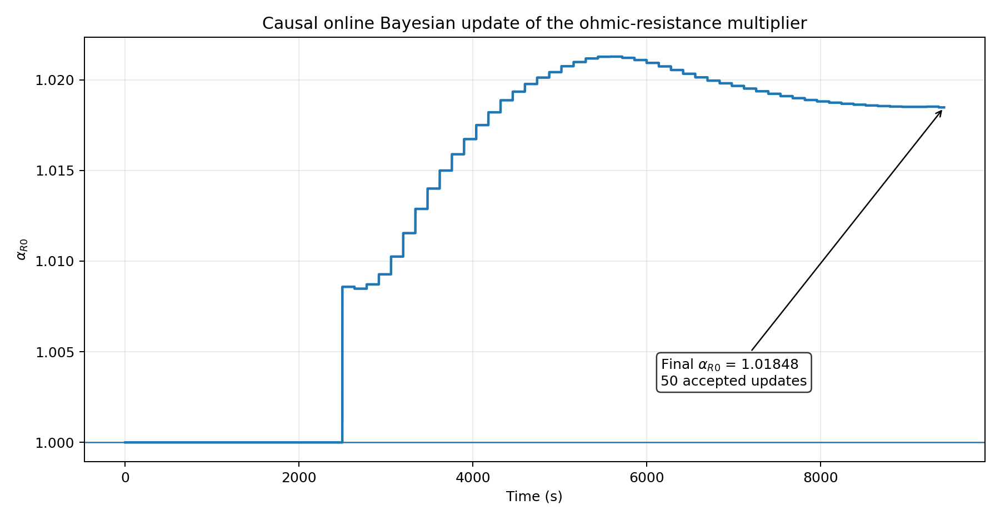
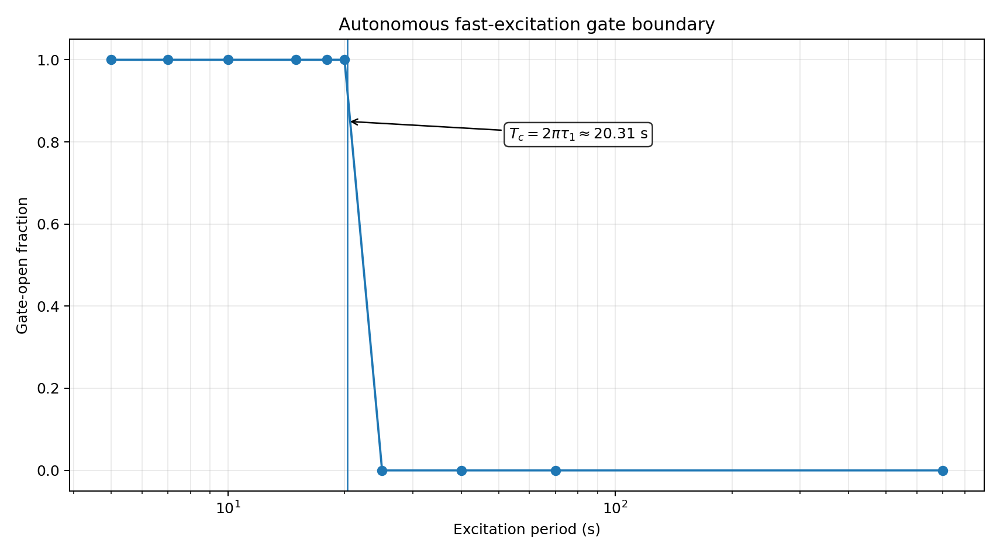
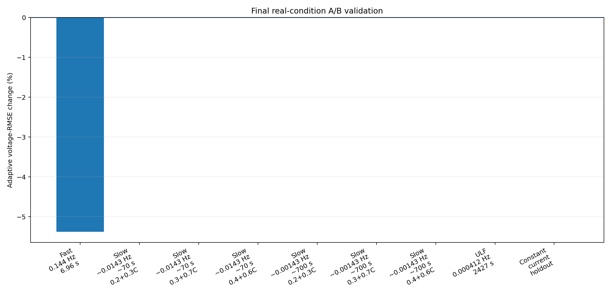
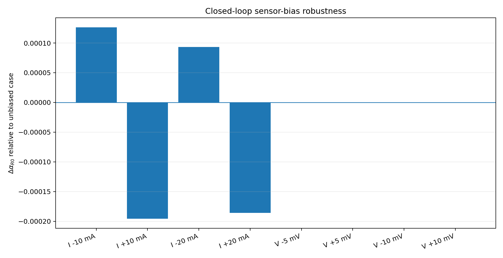

# Adaptive v1 validation

## Scope

This document summarizes the validation of the adaptive extension of the SOC-dependent 2RC Thevenin EKF for the LG INR18650 MJ1 cell.

The final candidate adds two layers around the frozen EKF baseline:

1. an autonomous current-based excitation detector; and
2. a causal online Bayesian scalar update of the ohmic-resistance map,

\[
R_0^*(SOC)=\alpha_{R0}R_0(SOC).
\]

The frozen state-transition model, RC lookup tables, process covariance, and EKF covariance logic are preserved.

## Why adaptation is gated

Constant-current sensitivity analysis showed strong confounding among \(R_0\), RC parameters, voltage offset, and capacity/SOC terms. Dynamic excitation was therefore used to test identifiability before enabling online parameter learning.

The validated fast-excitation development condition has a measured frequency of approximately

\[
f\approx0.144\ \mathrm{Hz},
\qquad
T\approx6.96\ \mathrm{s}.
\]

The historical experiment label for this record was `0.1τ`; this label is retained only as a dataset alias. Public technical descriptions use measured frequency and period.

The fast-branch reference time constant used by the autonomous gate is approximately

\[
\tau_{1,\mathrm{ref}}=3.2324\ \mathrm{s},
\]

giving a corner-period equivalent of

\[
T_c=2\pi\tau_1\approx20.31\ \mathrm{s}.
\]

The detector combines a 128-s current buffer, linear detrending, a toolbox-free DFT with local frequency refinement, excitation-RMS and spectral-concentration tests, the condition \(\omega\tau_1\ge1\), and open/close hysteresis.

## Online Bayesian result

For the validated fast condition:

- gate-open fraction after warm-up: `0.998386`;
- accepted Bayesian updates: `50`;
- final multiplier: \(\alpha_{R0}=1.018476993\).

Posterior-voltage RMSE over the 20–80% SOC analysis band changed from

\[
4.021863\ \mathrm{mV}
\]

for the frozen EKF to

\[
3.805565\ \mathrm{mV}
\]

for the autonomous adaptive estimator, a reduction of

\[
5.378\%.
\]

The corresponding squared-error reduction is approximately 10.5%.

The physical plant/state-transition path is unchanged by the \(R_0\) adaptation.

## Autonomous-gate validation

Synthetic excitation periods on the fast side of the identified corner were classified as open:

\[
5,\ 7,\ 10,\ 15,\ 18,\ 20\ \mathrm{s},
\]

while

\[
25,\ 40,\ 70,\ 700\ \mathrm{s}
\]

were classified as closed.

The 20-s synthetic case was detected at approximately 19.96 s.

## Real-condition A/B matrix

Nine real conditions were used in the final matrix:

- one fast periodic condition at approximately 0.144 Hz / 6.96 s;
- three slow conditions around 0.0143 Hz / 70 s;
- three slow conditions around 0.00143 Hz / 700 s;
- one ultra-low-frequency condition at 0.000412 Hz / approximately 2427 s; and
- one constant-current discharge holdout.

Only the fast condition enabled adaptation. All eight slow, ultra-low-frequency, or constant-current conditions remained gate-closed with zero Bayesian updates and \(\alpha_{R0}=1\).

Thus the adaptive architecture falls back numerically to the frozen EKF when the excitation gate is closed.

## Sensor-bias stress

The final closed-loop architecture was also tested with synthetic measurement offsets:

\[
b_I=\pm10,\ \pm20\ \mathrm{mA},
\]

and

\[
b_V=\pm5,\ \pm10\ \mathrm{mV}.
\]

All nine bias cases, including the unbiased baseline, passed the stated robustness checks. The maximum absolute shift in the final \(R_0\) multiplier relative to the unbiased case was approximately

\[
1.96\times10^{-4}.
\]

The largest update-count shift was one update.

These offsets are robustness stressors only; they are not estimated as augmented EKF states in the current architecture.

## Numerical-equivalence review

The original automated final regression reported 8/9 real-condition passes because one gate-closed condition produced a maximum adaptive-minus-frozen SOC difference of

\[
1.192\times10^{-9}\ \text{percentage points}
\]

against an equality threshold of

\[
1.0\times10^{-9}\ \text{percentage points}.
\]

For that same condition:

- gate-open fraction was zero;
- update count was zero;
- \(\alpha_{R0}=1\);
- plant difference was zero; and
- voltage-RMSE change was approximately \(6.3\times10^{-11}\%\).

The discrepancy is floating-point noise. A reviewed numerical-equivalence tolerance of \(10^{-8}\) percentage points was used, corresponding to \(10^{-10}\) in absolute SOC fraction. The reviewed real-condition verdict is therefore 9/9 PASS.

## Claim boundaries

The following limitations are part of the project result:

1. **Independent fast-band generalization is not yet demonstrated.** The current adaptive estimator has been developed and validated on one available fast-band DC–AC condition (measured \(f\approx0.144\) Hz, \(T\approx6.96\) s). Additional fast-band frequencies and current amplitudes are required for independent validation.
2. **The SOC reference is not independent ground truth.** The holdout reference is Coulomb-count based and uses the same reference-capacity convention.
3. **The autonomous gate is not yet a general drive-cycle persistent-excitation detector.** It has been validated for the project's periodic/sinusoidal excitation family.
4. **Unconditional all-timescale scalar-\(R_0\) adaptation is not supported.** Adaptation is enabled only behind the fast-excitation gate.
5. **Current and voltage offsets are not online estimated states** in v1.0.

## Next validation track

The next extension is deliberately separated from v1.0:

1. independent additional fast-band DC–AC datasets;
2. an oracle \(R_0\) performance-ceiling audit;
3. only then, evidence-driven consideration of SOC-dependent \(R_0\) scaling, constrained \(R_1/\tau_1\) adaptation, or alternative state estimators.
