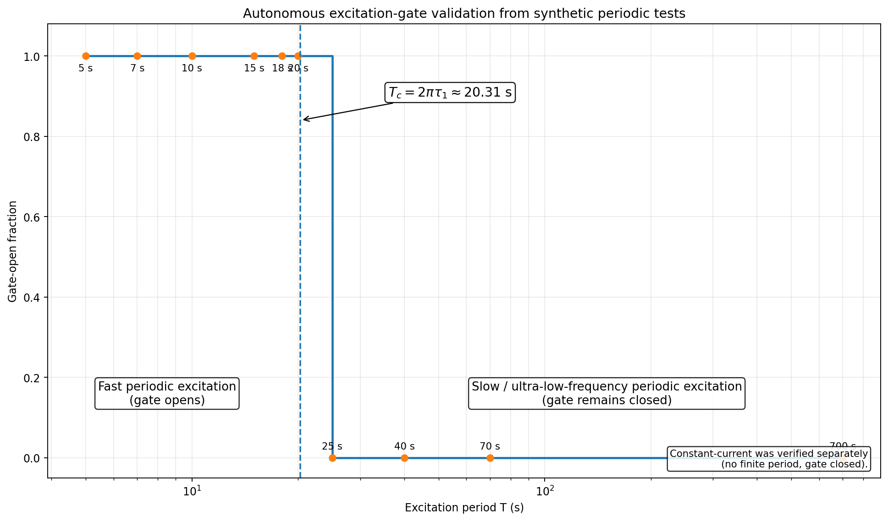
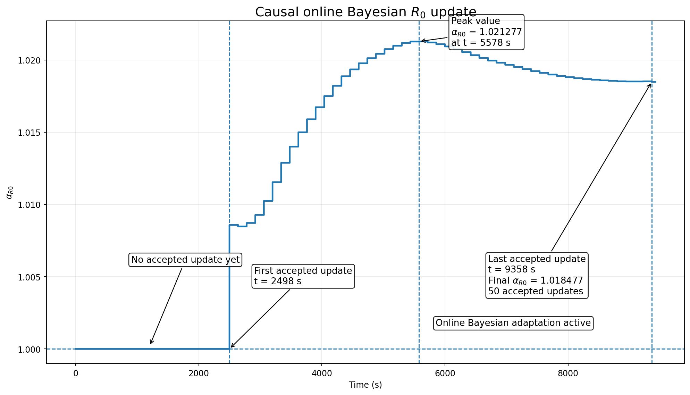

# Adaptive v1 validation

## Scope

This document contains the technical validation evidence for the adaptive extension of the SOC-dependent 2RC Thevenin EKF for the LG INR18650 MJ1 cell.

The final v1.0 architecture adds:

1. an autonomous current-based excitation gate; and
2. a causal online Bayesian scalar update of the ohmic-resistance map.

The frozen state-transition model and RC lookup tables are preserved.

The adaptive measurement-layer relationship is:

`R0*(SOC) = alpha_R0 × R0(SOC)`

## Identifiability rationale

Constant-current sensitivity analysis showed strong confounding among R0, RC parameters, voltage offset, and capacity/SOC terms. Parameter adaptation was therefore not enabled globally.

Dynamic excitation was used to establish when R0 is sufficiently separable from competing effects.

The fast-branch reference time constant used by the autonomous detector is approximately:

`tau1_ref = 3.232407 s`

which corresponds to the corner-period equivalent:

`Tc = 2 × pi × tau1_ref = 20.309815 s`

The historical experiment alias `0.1τ` corresponds to a measured fast excitation of approximately **0.144 Hz** with period approximately **6.96 s**.

## Autonomous excitation-gate validation

The detector uses:

- a 128 s rolling current buffer;
- linear detrending;
- a toolbox-free DFT;
- local frequency refinement;
- current-RMS thresholding;
- fast-band spectral-power fraction;
- dominant-peak concentration;
- the fast-branch frequency criterion; and
- three-positive / three-negative hysteresis.

Synthetic periodic validation produced:

- gate open: **5, 7, 10, 15, 18, 20 s**;
- gate closed: **25, 40, 70, 700 s**.

The 20 s case was detected at approximately **19.961 s**.

Constant-current was verified separately because it has no finite excitation period; the gate remained closed.

## Causal online Bayesian R0 update

For the validated fast development condition:

- first accepted update: **t = 2498 s**;
- peak alpha_R0: **1.021276588 at t = 5578 s**;
- last accepted update: **t = 9358 s**;
- final alpha_R0: **1.018476993**;
- total accepted updates: **50**.

The plotted trajectory below is generated directly from the validated online-core trace.

## Fast-condition voltage result

Over the 20–80% SOC analysis band:

| Metric | Frozen EKF | Adaptive EKF |
|---|---:|---:|
| Posterior-voltage RMSE | 4.021863 mV | **3.805565 mV** |
| Relative RMSE change | — | **−5.378%** |
| Approx. squared-error reduction | — | **10.5%** |
| Final alpha_R0 | 1.000000 | **1.018477** |

The physical plant/state-transition path remained unchanged.

## Final real-condition A/B matrix

Nine real conditions were included:

- one fast periodic development condition at approximately **0.144 Hz / 6.96 s**;
- three periodic conditions around **0.0143 Hz / 70 s**;
- three periodic conditions around **0.00143 Hz / 700 s**;
- one ultra-low-frequency condition at **0.000412 Hz / approximately 2427 s**;
- one constant-current discharge holdout.

Only the fast condition enabled adaptation.

All eight non-fast conditions remained gate-closed with:

- zero Bayesian updates;
- `alpha_R0 = 1`;
- unchanged plant outputs; and
- numerical fallback to the frozen EKF.

## Sensor-bias robustness

The final closed-loop architecture was tested with synthetic measurement offsets:

- current: **±10 mA, ±20 mA**;
- voltage: **±5 mV, ±10 mV**.

All nine cases, including the unbiased baseline, passed.

The maximum absolute final-alpha shift relative to the unbiased case was approximately:

`1.96 × 10^-4`

The largest update-count shift was **1**.

These offsets are robustness stressors only. They are not augmented EKF states in v1.0.

## Numerical-equivalence review

The original automated final regression reported one real-condition failure only because the maximum adaptive-minus-frozen SOC difference in one gate-closed condition was:

`1.192 × 10^-9 percentage points`

against an equality threshold of:

`1.0 × 10^-9 percentage points`

For that same condition:

- gate-open fraction = 0;
- update count = 0;
- `alpha_R0 = 1`;
- plant difference = 0;
- posterior-voltage RMSE change ≈ `6.3 × 10^-11 %`.

This is floating-point numerical noise rather than an algorithmic or physical difference.

Using the reviewed numerical-equivalence tolerance of `1 × 10^-8 percentage points`, the final reviewed real-condition verdict is **9/9 PASS**.

## Claim boundaries

The following limitations are part of the v1.0 result:

1. **Independent fast-band generalization is not yet demonstrated.** The only currently available fast development condition has measured frequency approximately **0.144 Hz** and period approximately **6.96 s**, and it participated in algorithm development.
2. **The SOC reference is not independent ground truth.** The holdout reference is Coulomb-count based and uses the same reference-capacity convention.
3. **The autonomous gate is not yet a general drive-cycle persistent-excitation detector.** Validation is limited to the project's periodic/sinusoidal excitation family.
4. **Unconditional all-timescale scalar-R0 adaptation is not supported.** Adaptation is enabled only behind the validated excitation gate.
5. **Current and voltage offsets are not online estimated states** in v1.0.

## Next validation track

The next extension is deliberately separated from v1.0:

1. independent additional fast-band DC–AC datasets;
2. an oracle R0 performance-ceiling audit;
3. only then, evidence-driven consideration of SOC-dependent R0 scaling, constrained fast-RC adaptation, or alternative state estimators.
